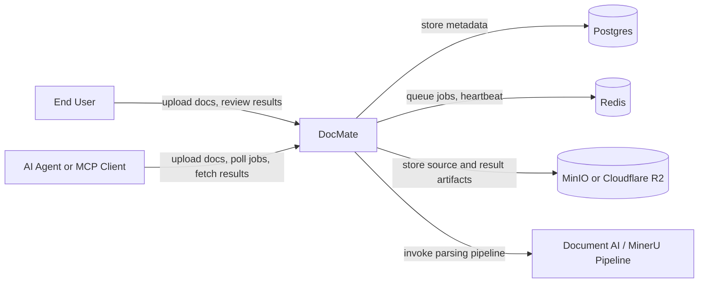
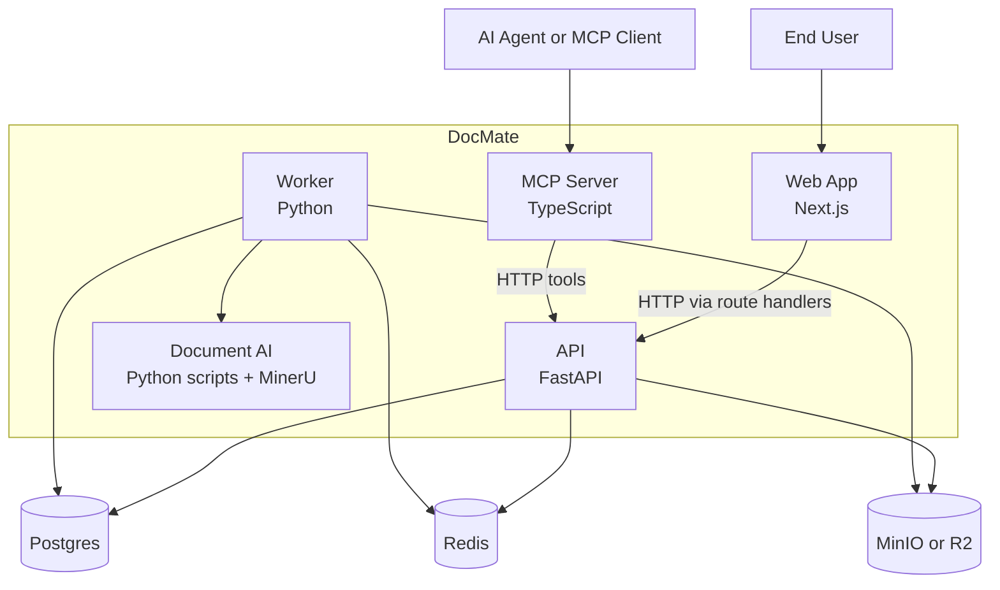
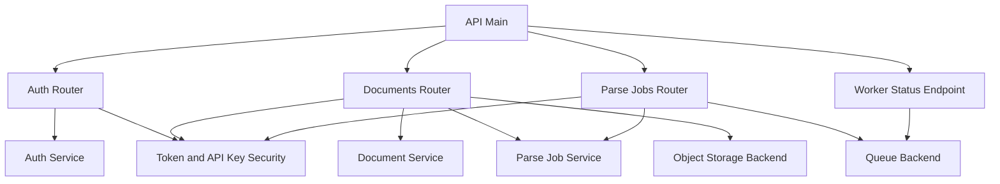
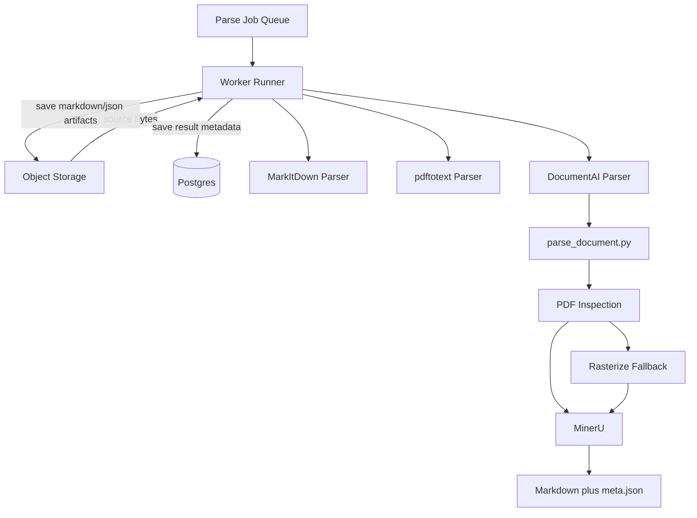
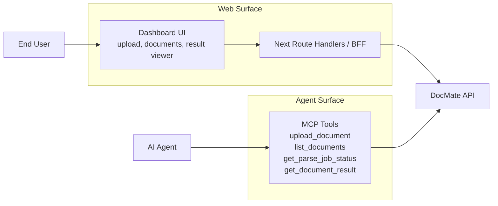

# DocMate Architecture

This document summarizes the `DocMate` architecture on the `main` branch in a C4-style format.

## 1. System Context

Description:
- Human users upload documents and review parsing results through the web UI.
- AI agents access the same system through MCP.
- The core responsibility of the system is to transform documents into Markdown and structured JSON artifacts that can be retrieved later.

## 2. Container Diagram

Description:
- `apps/web` provides the human-facing UI.
- `apps/api` handles authentication, documents, parse jobs, and worker status.
- Worker logic runs as a separate execution path for asynchronous parsing.
- `apps/mcp` exposes an agent-facing tool surface.
- `apps/ai` contains the actual document parsing pipeline.

## 3. API Component Diagram

Description:
- The API is primarily an orchestration layer rather than the parsing engine itself.
- Upload requests do not return parse results immediately; they create parse jobs.
- Authentication supports both bearer tokens and API keys.

## 4. Worker and Parsing Pipeline Component Diagram

Description:
- The worker pulls jobs from the queue and selects a parser backend.
- The `document_ai` path invokes `parse_document.py`.
- That script inspects the PDF and may rasterize it before running MinerU.
- The final Markdown and structured outputs are then stored.

## 5. Web and MCP Access Diagram

Description:
- The web application is the human-facing interface.
- MCP is the agent-facing interface.
- Both surfaces call the same API and consume the same document artifacts.

## Summary

`DocMate` can be understood as three connected layers:

- a human-facing web interface
- an agent-facing MCP interface
- a shared API, worker, storage, and parsing pipeline

The architectural center of gravity is closer to asynchronous parse job orchestration than simple document storage.
